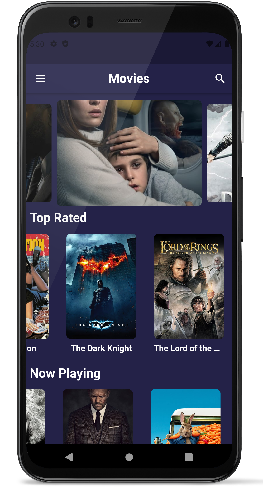
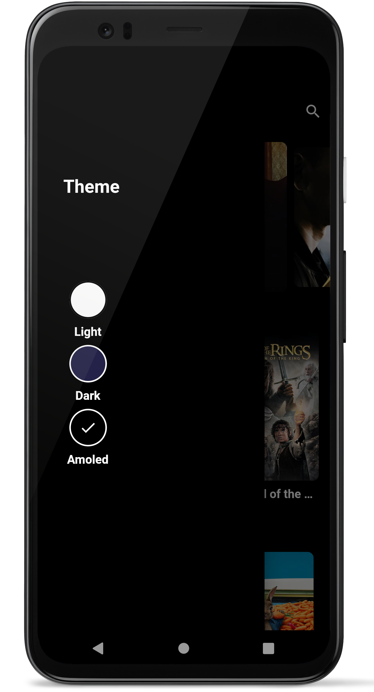
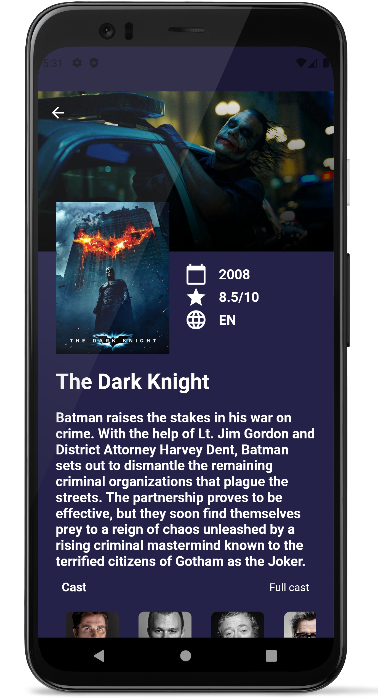
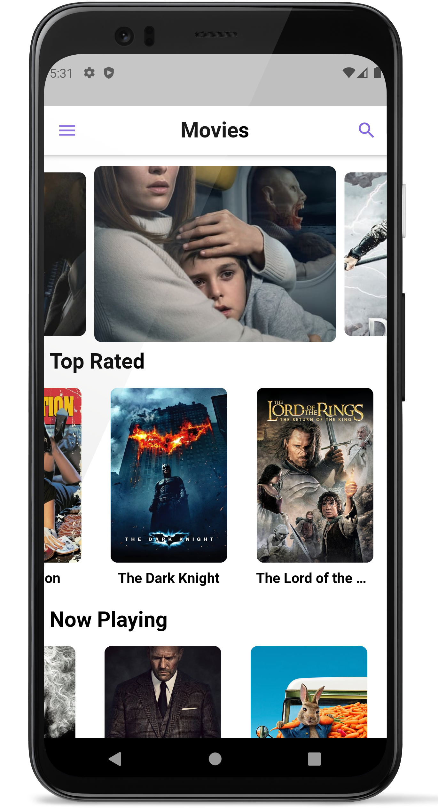
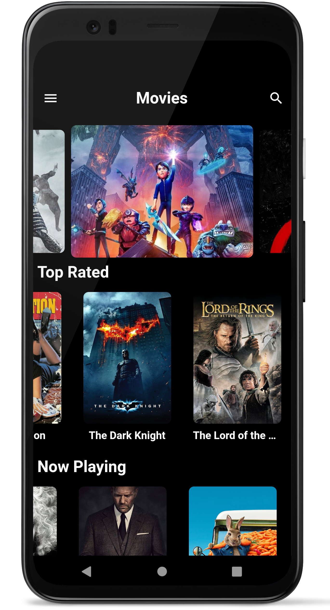
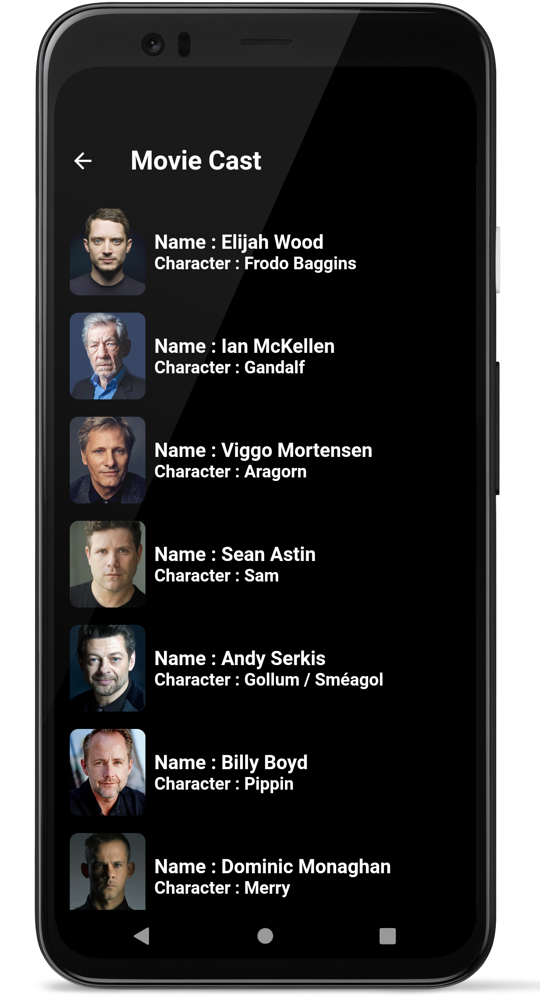
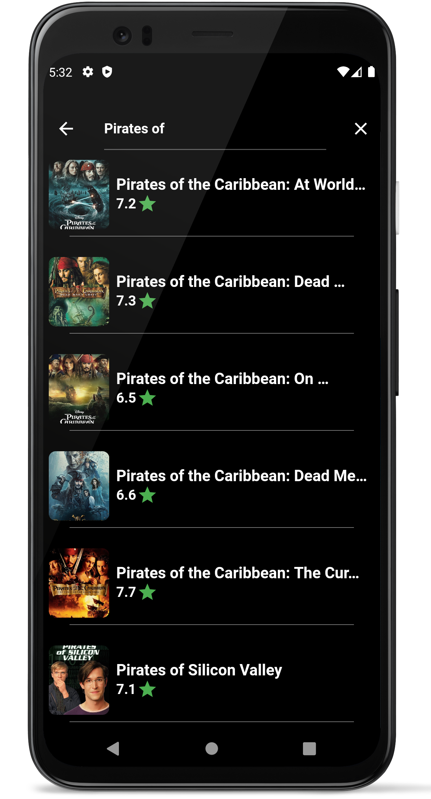
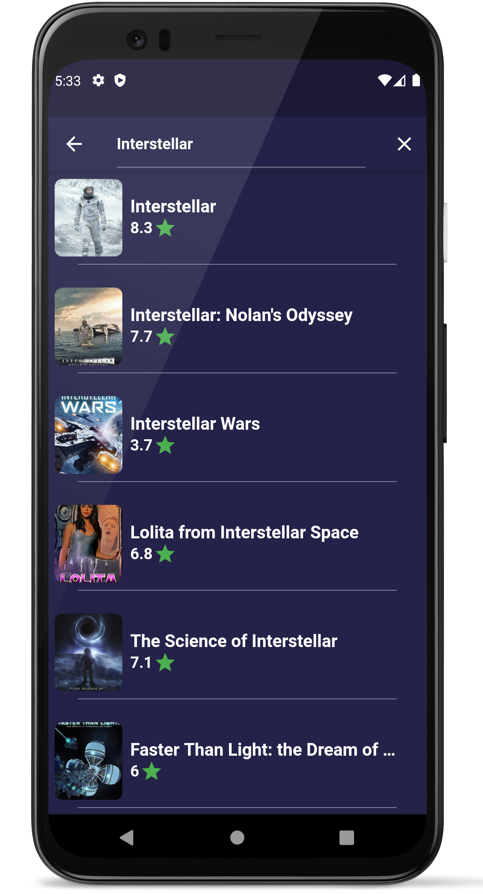

# My Movies App

A flutter based app that displays the list of Popular, Top Rated and Upcoming movies.

## Feautures

* Users can search and view any movie ever released
* Neat UI design
* Users can click on a movie for more details
* Users can view the full cast
* User can choose between three theme designs
* User can discover various new Movies
* Fast and efficient UI

## Screenshots (Android)

 
 
 
 

## To run this app
* Obtain api key from <a href ="https://www.themoviedb.org/">TMDB</a>.
* Replace YOUR_API_KEY in constants/api_constants.dart with your api key.
* Run the app with <b>flutter run</b>